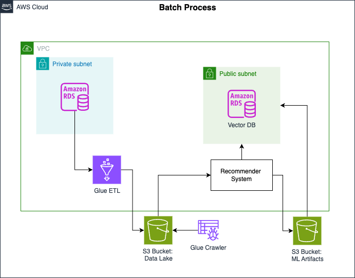
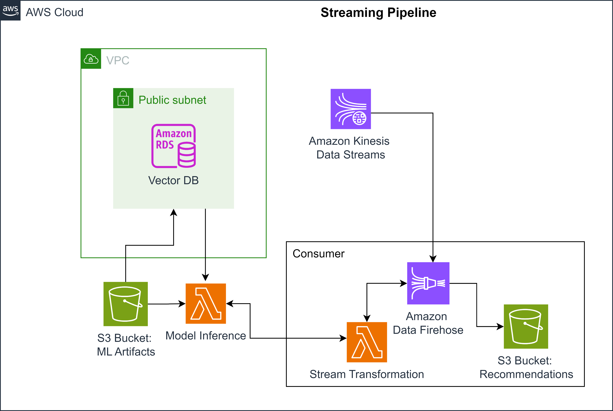
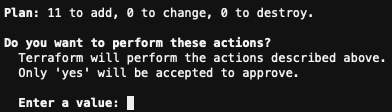

# End-to-End Recommendation System on AWS

This project implements a complete, end-to-end recommendation system using a two-speed architecture on AWS. It features a robust **batch pipeline** for preparing model training data and a low-latency **streaming pipeline** for delivering real-time recommendations. The entire infrastructure is managed declaratively using **Terraform**.

---

##  Architecture

The system is logically divided into two primary pipelines that work together to train a model and serve recommendations.

### 1. Batch Pipeline (For Model Training)

This pipeline is responsible for the heavy lifting of extracting data from the source database, transforming it into a clean format, and storing it for the data science team to train the recommendation model.



* **Source:** An **Amazon RDS (MySQL)** instance containing transactional data like users, products, and ratings.
* **Transformation:** An **AWS Glue ETL** job written in Spark processes and transforms the raw data into a feature-rich training dataset.
* **Destination:** The final training data is stored in a partitioned format in an **Amazon S3** bucket, which serves as our data lake.

#### **Output Data Schema**
The AWS Glue job transforms the various source tables into a single, denormalized schema that is optimized for the ML training process. The final schema is as follows:


### 2. Streaming Pipeline (For Real-Time Inference)

This pipeline uses the model artifacts (the trained model and its embeddings) to provide recommendations to users in real-time based on their activity.



* **Real-time Events:** User activity (e.g., clicks, add-to-cart) is ingested via **Amazon Kinesis Data Streams**.
* **Inference & Delivery:** **Amazon Data Firehose** consumes from the stream and uses a **Lambda function** for in-flight transformation. This Lambda function:
    1.  Loads the trained model from S3.
    2.  Queries a **Vector Database (PostgreSQL with `pgvector`)** to find similar items based on embeddings.
    3.  Generates a set of recommendations.
* **Destination:** The final recommendations are delivered to an **Amazon S3** bucket for the front-end application to consume.

---

## Key Features & Technologies

* **Infrastructure as Code:** The entire cloud infrastructure is defined and managed using **Terraform**, ensuring a repeatable, version-controlled, and automated setup.
* **Serverless ETL:** Leverages **AWS Glue** for scalable, serverless data transformation, avoiding the need to manage Spark clusters.
* **Real-time Ingestion:** Uses **Amazon Kinesis** to handle high-throughput, real-time event streaming.
* **Vector Similarity Search:** Employs a **PostgreSQL database on RDS with the `pgvector` extension** as a cost-effective and powerful vector database for fast, low-latency similarity searches.
* **Serverless Inference:** Implements a sophisticated pattern where **Kinesis Firehose** triggers a **Lambda function** to run model inference in a fully serverless, event-driven manner.
* **Decoupled Architecture:** The batch and streaming components are fully decoupled, allowing them to be scaled and maintained independently.

---

## Getting Started

The project is deployed in phases using Terraform modules.

### Prerequisites

* AWS Account & CLI configured
* Terraform installed
* Necessary environment variables set up (as handled by `./scripts/setup.sh`)

### Deployment Steps

1.  **Navigate to the Terraform directory:**
    ```bash
    cd terraform
    ```

2.  **Deploy the Batch Pipeline:**
    * Uncomment the `module "etl"` in `main.tf`.
    * Run `terraform init`, `terraform plan`, and `terraform apply`.
    * The `terraform apply` command will prompt you for confirmation after displaying the execution plan, which will look similar to this:
        
    * Trigger the created AWS Glue job to process the batch data.

3.  **Deploy the Vector Database:**
    * Uncomment the `module "vector_db"` in `main.tf`.
    * Run `terraform init`, `plan`, and `apply`.
    * Connect to the new PostgreSQL instance and run the `sql/embeddings.sql` script to load the model embeddings from S3.

4.  **Deploy the Streaming Pipeline:**
    * Manually configure the `de-c1w4-model-inference` Lambda with the Vector DB credentials.
    * Uncomment the `module "streaming_inference"` in `main.tf`.
    * Run `terraform init`, `plan`, and `apply` to deploy the Kinesis and Lambda resources.

---

## Project Structure
```
.
├── images/            # Architectural diagrams and visual assets for documentation.
├── scripts/           # Helper and setup shell scripts for the environment.
├── sql/               # SQL scripts for database setup (e.g., loading embeddings).
└── terraform/         # All Terraform Infrastructure as Code files.
    ├── main.tf        # Main entry point for composing the infrastructure modules.
    ├── variables.tf   # Definitions for input variables.
    ├── outputs.tf     # Declarations for infrastructure outputs (e.g., hostnames).
    ├── assets/        # Source code for compute services deployed by Terraform.
    │   ├── glue_job/  # Python/PySpark script for the AWS Glue ETL job.
    │   └── transformation_lambda/ # Python code for the stream transformation Lambda function.
    └── modules/       # Reusable modules for each component of the architecture.
        ├── etl/
        ├── vector-db/
        └── streaming-inference/
```
